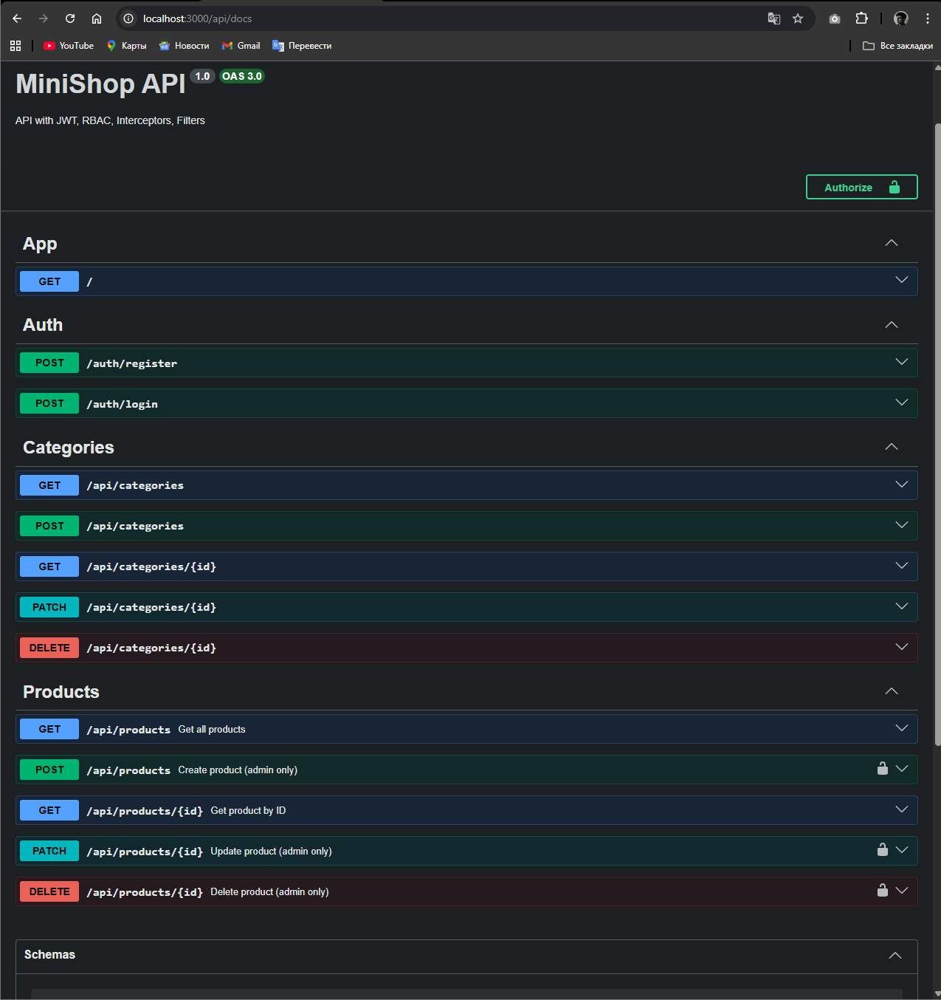

## Student

* Name: Лещенко Дмитро
* Group: 232.1

---

## Практичне заняття №6 — Interceptors + Exception Filters + Swagger

---

## Опис

У цьому проєкті реалізовано **MiniShop API**, який приведений до production-ready рівня.

Додано:

* 🔐 JWT Authentication (Bearer Token)
* 🛡 Guards + RBAC (ролі: user / admin)
* 📊 LoggingInterceptor — логування HTTP-запитів
* 🔄 TransformInterceptor — єдиний формат відповідей
* ❗ HttpExceptionFilter — стандартизована обробка помилок з traceId
* 📘 Swagger (OpenAPI) — документація + тестування API

---

## Структура проєкту

```bash
src/
├── auth/
├── users/
├── categories/
├── products/
├── common/
│   ├── enums/
│   │   └── role.enum.ts
│   ├── guards/
│   │   ├── jwt-auth.guard.ts
│   │   └── roles.guard.ts
│   ├── decorators/
│   │   ├── current-user.decorator.ts
│   │   └── roles.decorator.ts
│   ├── interceptors/
│   │   ├── logging.interceptor.ts
│   │   └── transform.interceptor.ts
│   ├── filters/
│   │   └── http-exception.filter.ts
│   └── pipes/
│       └── trim.pipe.ts
├── migrations/
├── main.ts
└── app.module.ts
```

---

## Запуск проєкту

```bash
cp .env.example .env
docker compose up --build
```

---

## Swagger UI

📍 Доступний за адресою:

```
http://localhost:3000/api/docs
```



---

## Формат успішної відповіді

```json
{
  "data": { ... },
  "statusCode": 200,
  "timestamp": "2026-04-28T12:00:00.000Z"
}
```

---

## Формат помилки

```json
{
  "error": {
    "code": 400,
    "message": "Validation failed",
    "details": [
      "name must be longer than or equal to 2 characters"
    ],
    "traceId": "a1b2c3d4-e5f6"
  },
  "timestamp": "2026-04-28T12:00:00.000Z"
}
```

---

## Приклад логів (LoggingInterceptor)

```text
[HTTP] GET /api/products — 200 — 8ms
[HTTP] POST /api/products — 201 — 12ms
[HTTP] GET /api/products/999 — 404 — 5ms
```

---

## Тестування через Swagger

1. Відкрити Swagger UI
2. Виконати `POST /auth/login`
3. Скопіювати `accessToken`
4. Натиснути **Authorize** і вставити токен
5. Викликати захищені ендпоінти (`POST /api/products`)

---

## Приклад помилки (traceId)

```json
{
  "error": {
    "code": 404,
    "message": "Product #999 not found",
    "traceId": "5362d95d-e24e-499f-961d-7b387e366dc3"
  },
  "timestamp": "2026-04-28T12:19:14.920Z"
}
```

---

## Висновок

У результаті виконання роботи було створено production-ready API з:

* централізованим логуванням
* єдиним форматом відповідей
* стандартизованими помилками
* повною Swagger документацією

API готовий до інтеграції з frontend та масштабування.

---

